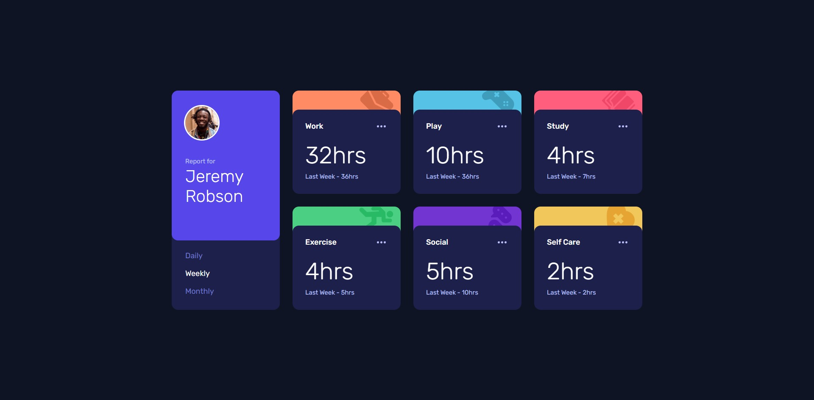

# Frontend Mentor - Time tracking dashboard solution

This is a solution to the [Time tracking dashboard challenge on Frontend Mentor](https://www.frontendmentor.io/challenges/time-tracking-dashboard-UIQ7167Jw). Frontend Mentor challenges help you improve your coding skills by building realistic projects. 

## Table of contents

- [Overview](#overview)
  - [The challenge](#the-challenge)
  - [Screenshot](#screenshot)
  - [Links](#links)
- [My process](#my-process)
  - [Built with](#built-with)
  - [What I learned](#what-i-learned)
  - [Continued development](#continued-development)
  - [Useful resources](#useful-resources)
- [Author](#author)

## Overview

### The challenge

Users should be able to:

- View the optimal layout for the site depending on their device's screen size
- See hover states for all interactive elements on the page
- Switch between viewing Daily, Weekly, and Monthly stats

### Screenshot



### Links

- [Solution URL](https://github.com/NikaDalalishvili/time-tracking-dashboard)
- [Live Site URL](https://nikadalalishvili.github.io/time-tracking-dashboard/)

## My process

### Built with

- Semantic HTML5 markup
- CSS custom properties
- Flexbox
- CSS Grid
- Mobile-first workflow
- [SCSS](https://sass-lang.com) - Sassy Cascading Style Sheets

### What I learned

This was my very first project where I used the API, I don't know how correct everything is, the main thing is that it works :D.

I used an **Import** Statement.
So I learned how to set a **type** attribute on the script in HTML file.


```html
<head>
  <script src="./assets/script/script.js" type="module"></script>
</head>
```
and Then how to import **data** to ./assets/script/script.js
```js
import data from '../data/data.json' assert { type: 'json' };
```

### Continued development

First I want to finish the javascript course I'm taking on freecodecamp, I'm also going through the learning path on Frontendmentor, and after that I want to focus more on React, Next.js and Node.js.

### Useful resources

- [ChatGPT](https://chatgpt.com/) - He is my hero, if I need something fast, if I can't understand something, or if I can't find it on the internet, I always ask him.
- [W3Schools](https://www.w3schools.com/) - This is my favorite documentation platform I've been using since I started programming, it's the best explained resource.
- [YouTube](https://www.youtube.com/) - I'm always looking for news and listening to other developers, sharing their experiences so that I can see many different solutions to a problem. look back on this project in the future.**

## Author

- Frontend Mentor - [@NikaDalalishvili](https://www.frontendmentor.io/profile/NikaDalalishvili)
- Instagram - [@nika.dala](https://www.instagram.com/nika.dala/)
- TikTok - [@nika.dala](https://www.tiktok.com/@nika.dala)
- YouTube - [@nikadala](https://www.youtube.com/@nikadala)
